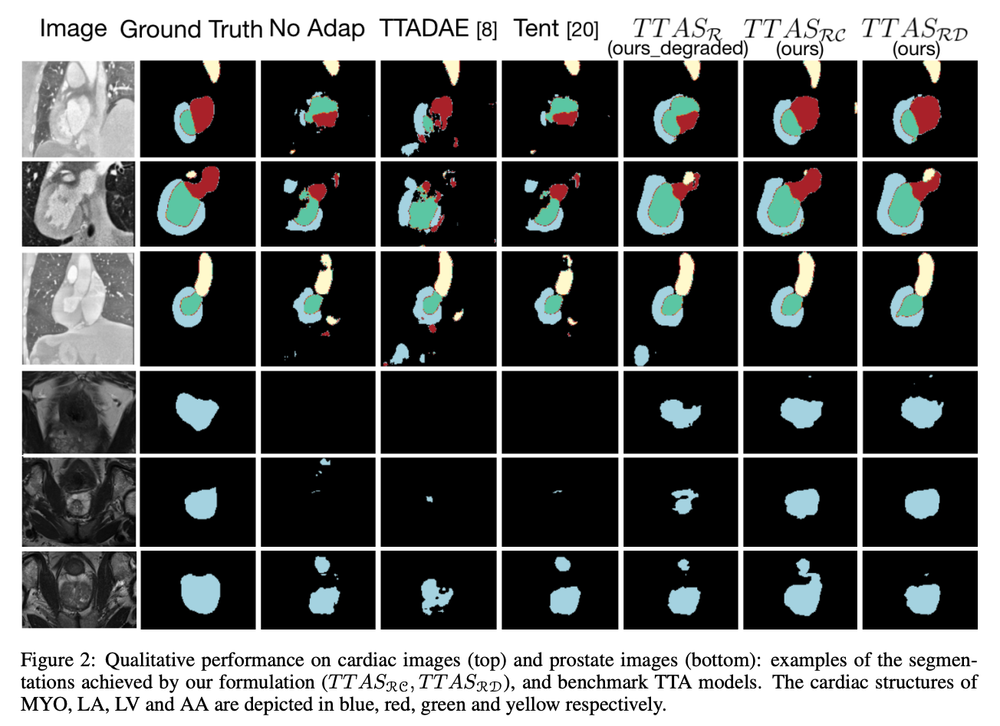

# Test-Time Adaptation with Shape Moments for Image Segmentation

[Mathilde Bateson](https://github.com/mathilde-b), Hervé Lombaert, Ismail Ben Ayed @ETS Montréal

Code of our submission at [MICCAI 2022] and its ongoing journal extension. 


* [MICCAI 2022](https://link.springer.com/chapter/10.1007/978-3-031-16440-8_70)
* [arXiv preprint](https://arxiv.org/abs/2205.07983)

Please cite our paper if you find it useful for your research.

```


@inproceedings{BatesonTTA,
	address = {Cham},
	author = {Bateson, Mathilde and Lombaert, Herve and Ben Ayed, Ismail},
	booktitle = {Medical Image Computing and Computer Assisted Intervention -- MICCAI 2022},
	editor = {Wang, Linwei and Dou, Qi and Fletcher, P. Thomas and Speidel, Stefanie and Li, Shuo},
	pages = {736--745},
	publisher = {Springer Nature Switzerland},
	title = {Test-Time Adaptation with Shape Moments for Image Segmentation},
	year = {2022}}

```



## Requirements
Non-exhaustive list:
* python3.6+
* Pytorch 1.0
* nibabel
* Scipy
* NumPy
* Matplotlib
* Scikit-image
* zsh
* tqdm
* pandas
* scikit-image

## Data scheme
### datasets
For instance
```
data
    prostate_source/
	    train/
		IMG/
		    Case10_0.png
		    ...
		GT/
		    Case10_0.png
		    ...
		...
	    val/
		IMG/
		    Case11_0.png
		    ...
		GT/
		    Case11_0.png
		    ...
		...
    prostate_target/
	    test/
		IMG/
		    Case10_0.png
		    ...
		GT/
		    Case10_0.png
		    ...
		...
```
The network takes png or nii or nii.gz files as an input. The gt folder contains gray-scale images of the ground-truth, where the gray-scale level is the number of the class (0,1,...K).

 

### results
```
results/
    prostate/
        fs/
            best_epoch_3d/
                val/
                    Case11_0.png
                    ...
            iter000/
                val/
            ...
        tta/
            ...
        params.txt # saves all the argparse parameters of the model 
	best_3d.pkl # best model saved
	last.pkl # last epoch
        IMG_target_metrics.csv # metrics over time, csv
        3dbestepoch.txt # number and 3D Dice of the best epoch 
        ...
    whs/
        ...
archives/
    $(REPO)-$(DATE)-$(HASH)-$(HOSTNAME)-sfda.tar.gz
    $(REPO)-$(DATE)-$(HASH)-$(HOSTNAME)-prostate.tar.gz
```
## Interesting bits
The losses are defined in the [`losses.py`](losses.py) file. 


## Related Implementation and Dataset
* [Mathilde Bateson](https://github.com/mathilde-b), [Hoel Kervadec](https://github.com/HKervadec), [Jose Dolz](https://github.com/josedolz), Hervé Lombaert, Ismail Ben Ayed. Constrained Domain Adaptation for Image Segmentation. In IEEE Transactions on Medical Imaging, 2021. [[paper]](https://ieeexplore.ieee.org/document/9382339) [[implementation]](https://github.com/mathilde-b/CDA) 
* [Hoel Kervadec](https://github.com/HKervadec), [Jose Dolz](https://github.com/josedolz), Meng Tang, Eric Granger, Yuri Boykov, Ismail Ben Ayed. Constrained-CNN losses for weakly supervised segmentation. In Medical Image Analysis, 2019. [[paper]](https://www.sciencedirect.com/science/article/pii/S1361841518306145?via%3Dihub) [[code]](https://github.com/LIVIAETS/SizeLoss_WSS)
* Prostate Dataset and details: https://liuquande.github.io/SAML/. The SA site dataset was used a target domain, the SB site was used as source domain. For both datasets, we use 20 scans for training, and the remaining 10 scans for validation.
* Heart Dataset and details: We used the preprocessed dataset from Dou et al. : https://github.com/carrenD/Medical-Cross-Modality-Domain-Adaptation. The data is in tfs records, it should be transformed to nii or png before running the makefile.


## Note
The model and code are available for non-commercial research purposes only.
